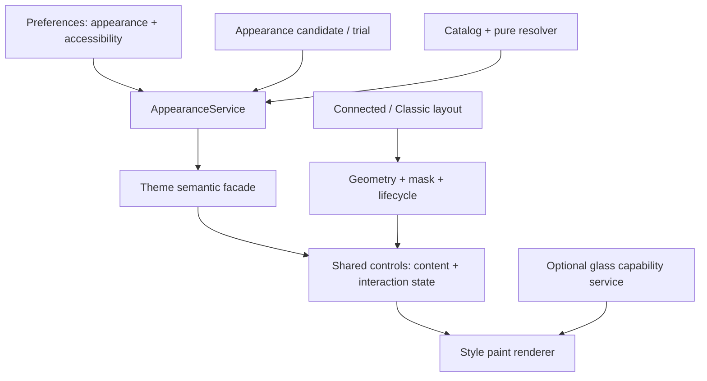

# Titonium — Design styles độc lập với Connected/Classic

Ngày: 2026-09-06. Trạng thái: **đề xuất để review; chưa triển khai**.

Người dùng đã chốt năm styles và yêu cầu không ảnh hưởng Connected/Classic. Tài liệu này cụ thể hóa kiến trúc, diện mạo, giới hạn kỹ thuật và nghiệm thu. Các giá trị thị giác bên dưới là điểm khởi đầu có thể tinh chỉnh sau khi xem QML thật, không phải số đo của một tiêu chuẩn bên ngoài.

## 1. Kết quả cần đạt

Settings → Appearance có **Glassmorphism, Material, Liquid Glass, Modern Flat, Neumorphism**. Đổi style phải thay đổi cách tổ chức bề mặt, độ nổi/lõm, cấu tạo control, trạng thái tương tác và chuyển động. Chỉ đổi palette, opacity, radius và một gradient chung không đạt yêu cầu.

Ba lựa chọn độc lập:

| Trục | Sở hữu | Ví dụ |
| --- | --- | --- |
| Layout | Bố cục, silhouette, anchor, input mask, lifecycle | Connected / Classic; Dock tiếp tục chính sách hiện tại |
| Design style | Cách vẽ surface và control, vật liệu, state layer, motion của control | Material / Neumorphism |
| Appearance customization | Light / Dark / System, accent, custom theo style và mode | Material + Dark + accent xanh |

Không thêm layout vào Appearance. Ví dụ Connected + Material và Classic + Material đều hợp lệ. Preview có thể mô phỏng hai layout bằng lựa chọn cục bộ nhưng không ghi `modules.bar.style` hoặc `modules.dock`.

## 2. Hiện trạng và các khoảng trống đã xác minh

- `Services/Appearance/ThemeCatalog.js`: Neutral/Glass/Soft/Graphite, mỗi loại có palette, năm material scalars và motionScale.
- `AppearanceRules.js`: normalize/resolve thuần; `AppearanceService.qml`: System mode, tokens và trial có generation.
- `Shared/Surface.qml`: cùng cây Rectangle cho shadow/paint/sheen. `ConnectedPillShape.qml` và `AnchoredMenuPillShape.qml`: mỗi loại một continuous path với gradient.
- Button, Toggle, Slider, Select và nhiều input/row vẫn vẽ Rectangle riêng. Đổi Surface chưa đủ thay ngôn ngữ thiết kế toàn shell.
- `Settings/components/ThemePreview.qml` vẽ miniature bằng logic riêng, nên hiện chưa chứng minh độ trung thực với component runtime.
- Draft, thử 15 giây, Keep, Apply, Cancel, Undo, Advanced và wallpaper recovery đã tồn tại. Mở rộng các contract này, không dựng lại transaction.
- Cây làm việc trên `main` có nhiều thay đổi và file chưa track từ các phần trước. Khi implementation phải lấy snapshot của **cây hiện tại**, không bắt đầu từ HEAD rồi bỏ mất Appearance/Center mới.
- Qt cài tại máy: **6.11.2**. Hyprland: **0.56.2**, commit `efb50993780079460b0cbed1363e2166a2de1d9f`. Lệnh đọc runtime `hyprctl plugin list` trả `no plugins loaded`.
- Native layer đang quan sát gồm `titonium-menubar`, `titonium-center-overlay`, `titonium-edge-menu`, `titonium-dock`. Các namespace popup/Settings phải được inventory khi mở fixture, không suy từ tên cũ.

Spec Appearance cũ vẫn mô tả đúng transaction đã xây, nhưng giới hạn “primitive presets, không shader” của nó không đáp ứng mục tiêu mới. Tài liệu này đề xuất thay phần presentation đó; không tự cấp phép sửa compositor hoặc chức năng được bảo vệ.

## 3. Lựa chọn kiến trúc

| Phương án | Ưu điểm | Đánh đổi | Quyết định |
| --- | --- | --- | --- |
| Thêm scalars vào preset hiện tại | Ít sửa | Năm style vẫn cùng cách vẽ | Loại |
| Nhân bản cả cây shell cho mỗi style | Tự do thị giác | Nhân lifecycle, bugfix, mask và test; dễ phá Connected | Loại |
| Contract paint chung + renderer theo style | Phân biệt diện mạo, giữ domain/layout | Cần chuẩn hóa state và audit consumer | **Chọn** |

Không tạo framework plugin tổng quát. Năm renderer tĩnh, một contract nhỏ. Loader chỉ đổi lớp paint vô trạng thái; content, focus scope, pointer handlers, control value và popup owner phải giữ nguyên object khi đổi style.



## 4. Ranh giới không được vượt

**Layout invariants:** không thay bar height, exclusive zone, dock placement, panel anchors, shoulder path, path topology, mask bounds, popup ownership, close generation, focus policy hoặc keyboard shortcuts khi đổi style. Không nhân style radius vào silhouette Connected. Classic giữ detached panels và compact pill đang hoạt động.

**Motion invariants:** style điều khiển micro-interaction của control và hiệu ứng paint. Animation mở/đóng/morph của layout tiếp tục dùng thời gian và easing hiện có. Phải tách control-motion tokens khỏi layout-motion trước khi đưa easing từng style vào; đổi style không làm callback teardown tới sớm/muộn hoặc remount host. Reduced Motion vẫn dừng cả hai nhóm.

**Geometry invariants:** control width/height, padding và text metrics mặc định ổn định; chỉ hình dạng paint bên trong đổi. Các radius truyền tường minh từ layout luôn thắng default style radius. Bóng có thể nở ra phần paint được cấp sẵn, không nới vùng bấm. Panel sát cạnh dùng ánh sáng phía trong nếu bóng ngoài bị clip; không mở rộng native surface chỉ để thêm bóng.

**Protected:** Spotlight và Super+Space/Super+V, Input Method, screen lifecycle, lazy overlays và routing được giữ. Chỉ chỉnh paint của các surface được bảo vệ trong phạm vi styles đã duyệt, không refactor model/service của chúng. Giữ coverage tương đương theo `AGENTS.md`.

**Ownership:** Theme không I/O; Services không import view; Shared/Bar/Overlay không Process/FileView/persistence. Không sửa hoặc reload hai `hyprland.lua`; không tự cài/load compositor plugin. Runtime settings ở ngoài Git. Chuỗi UI dùng `I18n.tr()`.

## 5. Đặc tả năm styles

Các kích thước là logical pixels. Radius panel áp dụng cho ordinary standalone surface; Connected và explicit-radius layout giữ geometry riêng. Cùng một accent phải vẫn phân biệt được năm styles.

| Thuộc tính | Glassmorphism | Material | Liquid Glass | Modern Flat | Neumorphism |
| --- | --- | --- | --- | --- | --- |
| Bề mặt | Kính mờ, tint dịu, xuyên nền đã blur | Surface có tonal hierarchy và elevation | Kính trong hơn, viền dày quang học, khúc xạ nền | Màu đặc, phẳng, phân nhóm bằng nét và tương phản | Nền/control gần cùng màu, khối nổi/lõm |
| Panel radius mặc định | 16 | 20 | 24 | 8 | 18 |
| Button radius mặc định | 10 | Capsule trong chiều cao hiện có | Capsule, highlight phía trên | 4 | 10 |
| Outline | 1px sáng nhẹ, không viền neon | Chủ yếu cho outlined/field/focus | Hai dải sáng–tối ở mép, không viền trắng đều | 1px rõ ở nơi cần phân tách | Thường không outline; focus riêng |
| Depth | Bóng rộng, nhẹ | Elevation phân theo surface/control/state | Viền lồi, specular và bóng mỏng | Không shadow/sheen | Cặp bóng sáng trên-trái, tối dưới-phải |
| Input | Kính đục hơn panel để đọc rõ | Tonal fill, indicator/focus rõ | Khoang kính yên, giữ text sắc nét | Fill đặc + border | Rãnh lõm, bóng trong đảo hướng |
| Hover | Tăng ánh sáng mép nhẹ | State layer + tăng elevation khi thích hợp | Dịch specular có giới hạn | Đổi fill/outline | Giảm độ nổi nhẹ |
| Pressed | Hạ ánh sáng, tint đậm hơn | Press state layer, ripple bị giới hạn | Nén phần paint nhẹ, specular đổi hướng | Fill đậm, không scale | Chuyển raised → inset |
| Selected | Accent fill/tick rõ | Tonal accent + indicator | Tint accent + indicator rõ | Accent fill + tick/bar | Inset + accent indicator; không chỉ bóng |
| Motion control khởi điểm | 140ms, OutCubic | 160ms, easing nhấn mạnh, không bounce | 220ms, spring damped, không animation idle | 90ms, OutCubic | 140ms, OutCubic |

### 5.1 Glassmorphism

Backdrop blur thật là tiêu chí full fidelity. Tint phải ổn định trên wallpaper sáng/tối/nhiều chi tiết và khi cửa sổ phía sau di chuyển. Glass không lens distortion. Surface con có opacity cao hơn để tránh chữ trộn với background. Không blur text/icon hoặc toàn root item. Fallback dùng nền đục và ghi “Hiệu ứng kính giới hạn” trong Appearance.

### 5.2 Material

Thiết kế theo nguyên tắc surface, tonal color và state layer của Material; không tuyên bố là bộ Material 3 certified. Button primary/secondary/quiet có hierarchy khác nhau. Toggle dùng track có outline khi off, thumb tương phản và indicator khi on. Slider dùng track rõ, thumb/elevation thay đổi theo state nhưng hit target không đổi. Ripple chỉ chạy khi có interaction, bị clip trong paint; keyboard activation cũng có phản hồi hữu hạn.

### 5.3 Liquid Glass

Full fidelity cần refraction của scene phía sau, specular/fresnel theo mép shape và alpha mask đúng khi Connected morph. Không dựng một ảnh wallpaper cố định rồi gọi đó là desktop refraction. Không screen-capture loop vì sẽ thu lại chính overlay, phát sinh feedback và tải GPU.

Phần QML chịu trách nhiệm bezel, tint, control shape, micro-motion và nội dung nét. Backend kính chịu trách nhiệm backdrop. Backend vắng/lỗi: giữ style đã chọn, dùng fallback readable, báo giới hạn; không đổi sang theme khác hoặc reset selection. Fallback không được đánh dấu là hoàn thành yêu cầu full Liquid Glass.

### 5.4 Modern Flat

Nền opaque, shadow/sheens bằng 0. Typography và khoảng phân nhóm tạo hierarchy; không giảm padding để làm “flat”. Hover/pressed/selected/focus đều phải nhận ra trong grayscale. Là default cho cài mới và fallback cuối cùng của resolver khi ID không hợp lệ.

### 5.5 Neumorphism

Surface/control lấy cùng base family, dùng hai nguồn bóng đối nhau. Button nghỉ nổi, pressed lõm; input và slider track luôn là rãnh lõm. Toggle thumb nổi trên track lõm. Dark mode giảm bóng đen và tăng highlight vừa đủ, không làm nền thành nhiều vòng viền phát sáng. Contrast text/focus/selected vẫn độc lập với bóng; tắt shadow custom không làm control mất trạng thái.

### 5.6 Typography và accessibility dùng chung

Giữ font family, size scale và text metrics đang có trong đợt đầu để tránh thay độ rộng compact pill. Style có thể đổi weight theo role trong giới hạn hiện có (Regular/Medium/DemiBold); không đổi font file hoặc icon vocabulary. Body/label nhỏ vẫn ưu tiên dễ đọc. Tương phản mục tiêu: text thường ≥4.5:1 trên bề mặt thực; focus và indicator ≥3:1 với màu kề. Đây là acceptance target của dự án, không phải tuyên bố chứng nhận accessibility.

Focus ring vẽ ở lớp riêng, không chịu `borderStrength`, shadow hoặc opacity tùy chỉnh. Disabled khác selected. Error/success/warning giữ semantic color và icon/text, không biến thành accent. Không thêm animation vô hạn. Reduced Motion đưa state tới endpoint ngay, không bỏ phản hồi selected/focus.

## 6. Contract kỹ thuật đề xuất

### 6.1 Catalog và compatibility

Public IDs: `glassmorphism`, `material`, `liquid-glass`, `modern-flat`, `neumorphism`; giữ tên field persisted `appearance.themeId` để không thêm state song song. `ThemeCatalog.catalog()` trả đúng năm descriptor mới; `ThemeCatalog.lookup(id)` resolve được cả chúng và bốn legacy IDs.

Đóng băng catalog hiện có thành `LegacyThemeCatalog.js`, chỉ dùng để đọc cấu hình đã lưu. Existing users giữ nguyên palette/material/overrides cho tới khi chọn style mới; Settings hiển thị “Đang dùng giao diện cũ: …” ngoài năm cards. Legacy không phải card thứ sáu và không có đường chọn mới. Cài mới mặc định `modern-flat`; v6/v7 thiếu themeId vẫn resolve Neutral tương thích như trước.

Giữ `schemaVersion: 8`: thay đổi cộng thêm ID hợp lệ, không thay cấu trúc document. Schema/validator/transaction phải chấp nhận 5 ID mới + 4 legacy IDs. Advanced tiếp tục lưu riêng `themeOverrides[id][mode]`; không tự copy override cũ qua ngôn ngữ mới. Overrides cũ được bảo toàn để Cancel/Undo trả đúng baseline. Khả năng downgrade sang binary cũ không được cam kết.

Wallpapers: giữ policy keep mặc định và custom path hiện tại. Bốn legacy pairs giữ nguyên đường dẫn. Năm styles mới bắt đầu không kèm wallpaper; policy theme chỉ selectable khi descriptor có ảnh cho mode đang chọn. Chuyển sang style không có ảnh trong lúc policy theme: yêu cầu candidate chuyển về keep qua thao tác UI rõ ràng, không áp dụng ảnh ngẫu nhiên hay báo lỗi file khó hiểu. Không tạo asset chỉ để minh họa khác biệt giữa styles.

### 6.2 Resolved snapshot

```js
{
  themeId: "neumorphism", mode: "dark", legacy: false,
  colors: { /* các semantic color keys hiện có, giữ nguyên tên */ },
  material: { backgroundOpacity: 1, borderStrength: 0,
    shadowStrength: 0.7, sheenStrength: 0, radiusScale: 1 },
  design: {
    renderer: "neumorphism", panelRadius: 18, controlRadius: 10,
    fieldTreatment: "inset", depthTreatment: "dual-shadow",
    controlMotion: { durationMs: 140, curve: "standard", pressScale: 1 },
    requiredBackdrop: "none"
  },
  motionScale: 1, reducedMotion: false
}
```

Code schema thật phải có toàn bộ color keys; đoạn trên chỉ minh họa phần contract mới. `design` không chứa callback, object native, layout name hoặc dimension của screen. `AppearanceRules.resolve(appearance, systemMode, reducedMotion)` giữ signature/purity. Capability môi trường là input riêng vào lớp paint, không làm normalize phụ thuộc plugin đang chạy.

Advanced ranges legacy giữ nguyên. Với styles mới, opacity chỉ chỉnh được ở styles kính và giới hạn an toàn do capability quyết định; fallback readable không thấp hơn .85. Material/Flat/Neumorphism opaque. `radiusScale` .75–1.25 chỉ áp dụng ordinary paint; `motionScale` .5–1.5 cho control motion mới. Shadow/sheen disabled khi style không sử dụng; custom không được biến Flat thành Glass. Giá trị override bị khóa vẫn lưu nhưng không dùng, reset có nhãn rõ.

### 6.3 Paint contract

`Shared/StylePaint.qml`: nhận `tokens`, `role`, `state`, `geometry`, `backdropCapability`; không đọc Preferences. Role hữu hạn: `surface`, `panel`, `button`, `field`, `toggle-track`, `toggle-thumb`, `slider-track`, `slider-thumb`, `menu-row`. State gồm enabled/hovered/pressed/selected/focused/primary/danger. Geometry chứa rect + corner radii hoặc reference tới shape mask do layout sở hữu.

Control sở hữu content và event handlers. StylePaint chỉ là sibling phía sau content; focus ring là sibling phía trên. Không dùng default content alias đưa content vào Loader. `StyleRules.paint(tokens, role, state)` resolve treatment, color và elevation thuần, không tạo timer; `StyleRules.controlMotion(tokens)` trả duration/curve/pressScale đã xử lý Reduced Motion.

Năm file paint riêng dưới `Shared/styles/`: `FlatPaint.qml`, `MaterialPaint.qml`, `FrostedPaint.qml`, `LiquidPaint.qml`, `NeumorphicPaint.qml`, cộng `qmldir`. Chỉ tách effect helper khi thực sự dùng lại, không tạo hierarchy renderer/backend trừu tượng rộng.

Connected giữ path hiện tại làm nguồn geometry duy nhất. Hiệu ứng phải clip theo chính shape đó; không copy chuỗi PathLine/PathCubic cho từng style. Không vẽ hai lớp alpha trùng trên seam. Không giới thiệu shadow chữ nhật bao quanh toàn window fullscreen của Center/Edge.

## 7. Backend kính: bước kiểm chứng bắt buộc

| Cách | Khả năng | Lựa chọn |
| --- | --- | --- |
| QML gradient/sheens | Vẽ vật liệu cục bộ; không đọc desktop phía sau | Fallback và chrome |
| Qt ShaderEffectSource | Lấy texture của QML item được cấp; không tự có desktop backdrop | Dùng cho preview nội bộ khi cần, không nhận là native desktop glass |
| Compositor layer blur | Có thể cung cấp frosted backdrop | Candidate cho Glassmorphism, cần xác minh Hyprland 0.56.2 thực tế |
| HyprGlass | Candidate blur/refraction cho layer surfaces | Spike tương thích ABI, alpha mask, namespace và rollback trước integration |

Spike phải trả một trong ba verdict: `native-ready`, `blur-only`, `fallback-only`, kèm evidence. Kiểm tra runtime dependency không đồng nghĩa plugin đã được cài/nạp. Không tự tải `.so`, cài plugin, sửa hoặc reload compositor để vượt gate. Nếu full glass cần bước setup ngoài repo, chuẩn bị patch/setup chính xác và báo dependency đó để người dùng quyết định riêng; phần Material/Flat/Neumorphism vẫn triển khai được.

Contract capability cho spike: `{level: "none"|"blur"|"refraction", available: bool, reason: string, revision: string}`. Nếu adapter thực tế chỉ quan sát backend đã cấu hình bên ngoài, phải xác minh backend không áp hiệu ứng lên Material/Flat/Neumorphism. Nếu cần command đổi effect ở trial, triển khai lease capture/apply/restore theo generation trong **một Service**, chỉ allowlist namespace Titonium trên output hợp lệ; restore khi timeout/cancel/owner-loss/save-failure. Không sửa global option ảnh hưởng app khác. Không có scope/rollback đảm bảo thì native integration trượt, không âm thầm áp dụng.

Native fidelity acceptance: di chuyển một cửa sổ có pattern phía sau panel; Glass làm mờ, Liquid làm méo vùng cạnh, text Titonium không méo; Connected path mở rộng không có khung chữ nhật/halo/seam; chuyển Flat hiệu ứng biến mất. Screenshot wallpaper-only không đủ chứng minh.

## 8. Preview và Appearance UI

Năm cards có tên, mô tả một câu và mẫu component thật: button, field, toggle, slider; giữ cùng palette demo để nhìn thấy khác biệt cấu trúc. Grid 2 cột ở panel hẹp, 3 cột ở rộng; tên dài wrap tối đa hai dòng, không ép năm cards vào một hàng.

Preview lớn nhận candidate tokens và layout-preview local. Cùng renderer với shell, không import live shell services, không tạo listener hay native window. Nút/toggle demo phản hồi cục bộ; không điều chỉnh volume, network hay Preferences. Preview kính trên scene mẫu ghi rõ đó là mẫu; trạng thái runtime glass hiển thị cạnh lựa chọn style nếu ảnh hưởng kết quả Apply. Không nói đã bật native effect chỉ vì card vẽ đẹp.

Giữ thứ tự: heading → Light/Dark/System → design style cards → preview → Try/Keep/Revert → accent/Advanced → wallpaper. Accent tách khỏi style, không yêu cầu chọn lại style khi đổi màu. Existing local candidate, edit-mode pinning và lazy Advanced giữ nguyên. Chỉ Apply mới persist; Keep không phải Apply.

## 9. Tích hợp theo bề mặt

| Nhóm | Phạm vi paint | Giữ nguyên |
| --- | --- | --- |
| Shared controls | Surface/Panel/Button/Toggle/Slider/Select, field background | API, signals, keyboard, value bindings |
| Settings | Workspace chrome, rows, cards, input backgrounds | Draft, page routing, save state |
| Topbar Connected | Continuous path, control feedback | Shoulders, anchors, mask, branch lifecycle |
| Topbar Classic | Detached Surface backgrounds | Layout, hitboxes, reservation |
| Center | Compact/expanded chassis, tabs, control backgrounds | Domain, adapter, generation, media actions |
| Dock | Chassis, pin/button chrome, menus | Autohide, pins, screen/placement |
| Popups | Network/Bluetooth/Audio/SystemTray backgrounds và rows | Native service operations |
| Notifications | Toast, history, critical banner chrome | Dismiss/expiry/FIFO semantics |
| Spotlight/Switcher | Panel và input/list paint | Search, selection, launch/clipboard/keybindings |

Không recolor artwork, app logos, screenshots, mascot illustration hoặc category/content colors có chủ đích. Audit hard-code phải phân biệt chrome với nội dung.

## 10. Kiểm chứng và tiêu chí hoàn thành

**Pure contracts:** 5 public styles khác treatment; legacy roundtrip; malformed ID/prototype keys; custom isolation; contrast; Reduced Motion; merge candidate giữ nguyên toàn bộ modules; no dependence on layout.

**QML interactions:** Tab/Shift+Tab/Space/Enter, click đúng một signal, disabled không fire, toggle/slider/select giữ semantics, focus survives paint switch, input selection/caret không reset. Paint-only opacity, explicit corner radii, offscreen fallback và Loader cleanup phải test trên component thật.

**Visual matrix:** 5 styles × 2 layouts × 2 modes = 20 tổ hợp cơ bản. Scale 1 và 1.5 nâng thành 40 captures trên specimen chung. System đổi light/dark, Reduced Motion, bright/dark/busy backdrops, fallback/backend-loss là focused cases bổ sung. Với toàn shell, kiểm tra từng nhóm bề mặt ở cả layout, rồi sampling state theo risk; không gọi đó là đã test mọi hoán vị.

**Performance:** so với snapshot baseline cùng scene/thiết bị; idle 30s không xuất hiện render loop mới; không screenshot polling; sau 20 lần mở/đóng loader/effect resources về baseline; đo CPU/GPU/frame-time trong 10s morph/scroll trước/sau. Mục tiêu local: p95 frame time không tăng quá 2ms hoặc 15% (ngưỡng lớn hơn), không thêm quá 1 điểm phần trăm CPU idle. Đây là release budget cần đo, không phải kết quả đã đạt; native glass vượt budget phải giảm chất lượng có nhãn hoặc chặn full-quality release.

**Required gates:** `./scripts/check.sh`, `./scripts/smoke.sh`, `./scripts/protected_acceptance.sh`, `hyprctl configerrors`. Smoke/live acceptance từ snapshot cách ly để tránh duplicate instance guard. Không launch app hoặc ghi clipboard tự động; không thay wallpaper thật bằng automated tests. Notification live test có thể skip khi D-Bus đã có owner, phải ghi rõ.

Hoàn thành core styles ≠ hoàn thành full native glass. Báo cáo cuối phải tách implemented / tested / visually reviewed / backend-limited. Native glass chỉ đánh dấu đạt sau fidelity và rollback gate; không gọi cả task hoàn tất nếu native requirement còn thiếu mà chưa được người dùng chấp nhận giảm scope.

## 11. Nguồn và provenance

- [Qt ShaderEffectSource](https://doc.qt.io/qt-6/qml-qtquick-shadereffectsource.html): texture input là QML item, resource/live behavior. Không sao chép code.
- [Qt ShapePath](https://doc.qt.io/qt-6/qml-qtquick-shapes-shapepath.html): fillItem từ Qt 6.8; candidate để dùng cùng shape geometry, cần GPU/software fixture.
- [Qt RectangularShadow](https://doc.qt.io/qt-6.10/qml-qtquick-effects-rectangularshadow.html): candidate shadows cho ordinary rounded rectangles. Không suy ra hỗ trợ arbitrary Connected path.
- [Material states](https://m3.material.io/foundations/interaction/states/overview): tham khảo phân biệt interaction states; token values trong spec là thiết kế Titonium.
- [hyprnux/hyprglass](https://github.com/hyprnux/hyprglass): candidate BSD-3-Clause. Đã inventory `src/GlassLayerSurface.cpp`, `src/GlassLayerCompositeElement.cpp`, `src/GlassRenderer.cpp`, `src/LayerGeometry.hpp`, `src/PluginConfig.cpp`, `src/Shaders.hpp`, `hyprpm.toml`, `.hyprland-version`. Chưa pin revision hoặc xác nhận ABI máy; là đầu ra bắt buộc của spike, chưa được phép import/adapt code.
- [purple-lines/liquid-glass-plugin-hyprpm](https://github.com/purple-lines/liquid-glass-plugin-hyprpm): candidate thay thế đã nhận diện; chưa audit nguồn/license/ABI, không chọn làm dependency trong plan.

Các URL upstream `main` chỉ phục vụ discovery. Trước khi adapt phải pin SHA, đọc LICENSE tại SHA và ghi exact files cùng attribution. Không import theme engine của dự án khác.
